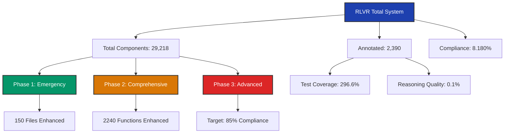

# RLVR Coverage Map

```mermaid

graph TD
    A[RLVR Total System] --> B[Total Components: 29,218]
    A --> C[Annotated: 2,390]
    A --> D[Compliance: 8.180%]

    B --> E[Phase 1: Emergency]
    B --> F[Phase 2: Comprehensive]
    B --> G[Phase 3: Advanced]

    E --> H[150 Files Enhanced]
    F --> I[2240 Functions Enhanced]
    G --> J[Target: 85% Compliance]

    C --> K[Test Coverage: 296.6%]
    C --> L[Reasoning Quality: 0.1%]

    style A fill:#1e40af,stroke:#333,stroke-width:2px,color:#fff
    style E fill:#059669,stroke:#333,stroke-width:2px,color:#fff
    style F fill:#d97706,stroke:#333,stroke-width:2px,color:#fff
    style G fill:#dc2626,stroke:#333,stroke-width:2px,color:#fff

```
